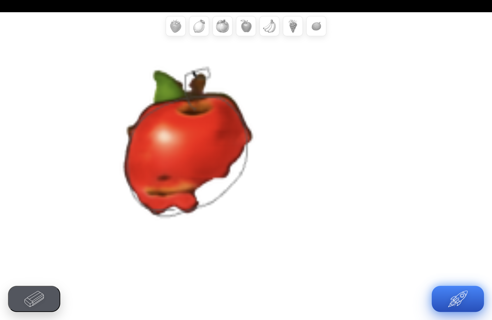
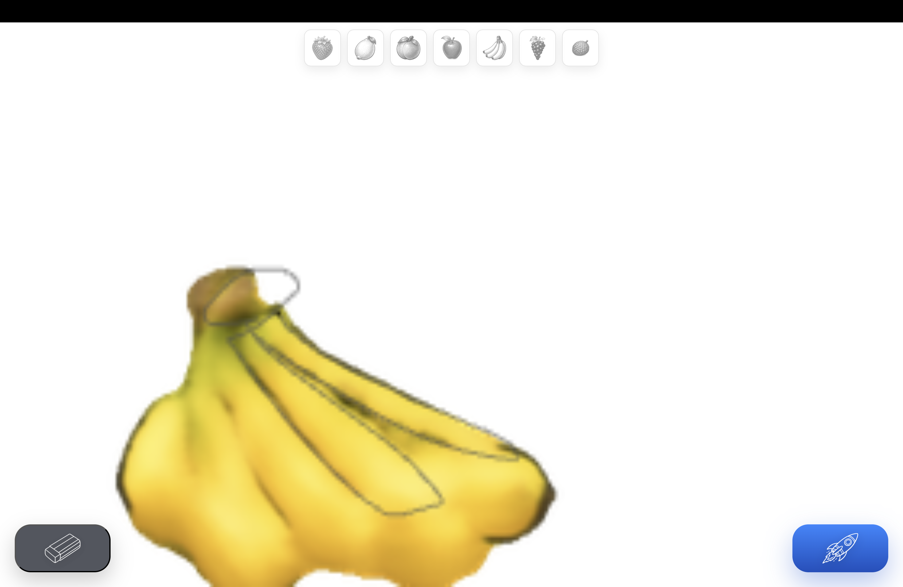
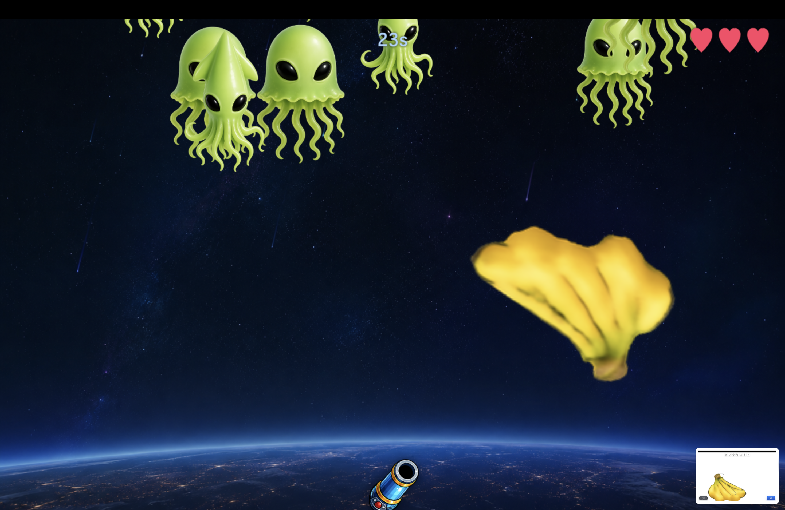
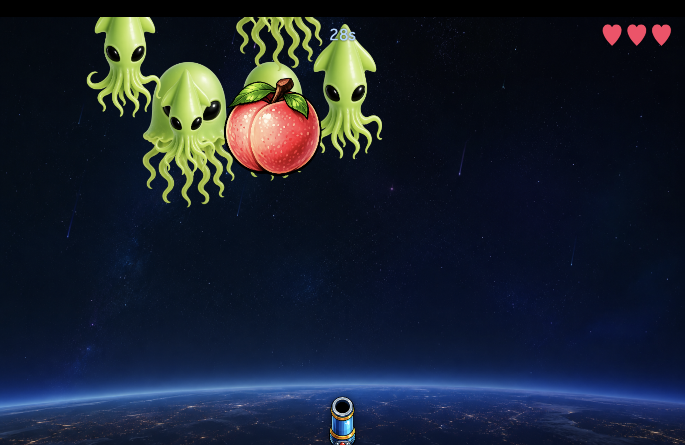

# Fruit_shooting

手描きの線画から機械学習でフルーツ弾を生成し、そのまま宇宙シューティングに撃ち込める展示作品です。  
東京大学 2025 年 5 月祭で、精密工学科の企画として展示しました。来場者の体験数はおよそ 200 人規模で、100 人以上がゲームクリアに到達しました。






## 作品概要

この作品では、来場者が iPad 上でフルーツの線画を描くと、その絵をその場でモデルが判定し、対応するフルーツ画像を生成してゲーム内の弾として使います。  
単なる「お絵描き認識」ではなく、

- 描いた線画をフルーツの種類として判定する
- 判定結果に応じて見た目の異なるフルーツ画像を生成する
- 生成したフルーツごとにゲーム内効果を変える

という流れが一続きでつながっているのが、この展示の中心です。

特に面白いポイントは機械学習部分で、来場者の手描き入力がそのままゲーム体験の見た目と攻略性に直結します。

## このゲームの流れ

1. 来場者が `draw2` 画面でフルーツの輪郭を描く
2. 判定モデルがその線画を見て、どのフルーツに近いかを推定する
3. 生成モデルが線画からフルーツ画像を生成する
4. 生成されたフルーツが弾としてゲーム内へ送られる
5. フルーツの種類ごとに攻撃の性質が変わる

ゲーム中で使うフルーツは 3 種類です。

- バナナ
- りんご
- ぶどう

## 機械学習がこの作品の核

この作品の見どころは、来場者の線画を「正解ラベルに変換するだけ」で終わらせず、線画そのものをゲームの資産に変えている点です。  
内部では大きく 2 系統のモデルを使っています。

### 1. フルーツ判定モデル

まず、来場者が描いた線画が何のフルーツなのかを判定します。

実運用では `apple / banana / grape` の 3 クラス分類モデルを使用しています。  
推論時の流れは次のとおりです。

1. キャンバス画像から描画領域を切り出す
2. 余白をつけて正方形に整形する
3. `128x128` にリサイズする
4. 背景と線だけの二値画像にする
5. 分類モデルへ入力し、3 種のスコアを得る

この処理は主に [src/electron_predict_worker.py](/Users/kannn/main/PROGRAM/sample_26_0214~/make2/src/electron_predict_worker.py) で実装されています。  
実際に読み込んでいるモデルは `src/generate_fruit/model/judge_model/quickdraw_fruit_128_sigmoid.keras` です。

### 2. フルーツ生成モデル

判定されたフルーツ種別に応じて、線画からフルーツ画像を生成します。  
ここでは PyTorch ベースの U-Net 系モデルを使い、フルーツごとに別モデルを持っています。

- バナナ: 線画から RGBA のフルーツ画像を生成
- りんご: 線画から高解像度の RGBA 画像を生成
- ぶどう: 線画から RGBA 画像を生成

実装は [src/generate_fruit_pipeline.py](/Users/kannn/main/PROGRAM/sample_26_0214~/make2/src/generate_fruit_pipeline.py) にあり、以下の学習済み重みを読み込みます。

- `src/generate_fruit/model/400color/best_model_banana_color400_2.pt`
- `src/generate_fruit/model/400color/apple_512.pt`
- `src/generate_fruit/model/400color/best_model_grape_new.pt`

線の形からそれらしい色・陰影・アルファ付き画像を生成するため、「自分が描いた絵が、そのまま弾になる」体験が成立しています。

### 3. フルーツごとにゲーム性が変わる

生成されたフルーツは見た目が違うだけではなく、攻撃特性も変わります。

- りんご: 爆発系
- ぶどう: 拡散・破片系
- バナナ: 基本弾として扱いやすい

つまり機械学習の出力が、視覚表現とゲーム攻略の両方に影響します。ここがこの企画のいちばん面白い部分です。

## `machineLearning/` ディレクトリについて

`machineLearning/` は、この作品で使った判定モデル・生成モデルの企画、実験、学習を行ったコード置き場です。  
これらはすべて Google Colab 上で実行していた学習コードで、展示本番のアプリ本体を直接動かすコードではありません。

入っている主なファイルは次のとおりです。

- `machineLearning/judge.py`
- `machineLearning/judge.ipynb`
- `machineLearning/apple_color.py`
- `machineLearning/apple_color.ipynb`
- `machineLearning/banana_color.py`
- `machineLearning/banana_color.ipynb`
- `machineLearning/grape_color.py`
- `machineLearning/grape_color.ipynb`

### `machineLearning/judge.py` の位置づけ

`machineLearning/judge.py` は、Quick, Draw! 系のストロークデータを使って 7 種類のフルーツを判定するための学習コードです。  
対象クラスは次の 7 種です。

- apple
- banana
- grapes
- strawberry
- pineapple
- watermelon
- pear

さらに「フルーツではない落書き」を弾くための negative class も多数混ぜて学習しています。  
このコードでは、

- ndjson データのダウンロード
- ストローク列の rasterize
- 二値画像化
- TFRecord 化
- TensorFlow / Keras による学習
- しきい値付き判定

までを Colab 上で一通り回せるようになっています。

重要なのは、この `judge.py` 自体は 7 クラス版だという点です。  
実際にシューティングゲームで使っているのは 3 種類のフルーツを判定するモデルですが、前処理の考え方や「手描き線画を正規化して分類する」という仕組みは同じです。  
つまり `machineLearning/judge.py` は、展示用 3 クラスモデルへつながる判定系の実験・拡張版として見るとわかりやすいです。

### `apple_color.py` / `banana_color.py` / `grape_color.py` の位置づけ

これらは各フルーツの色付き画像生成モデルを学習する Colab 用コードです。  
共通して、

- 入力: 手描き線画を整形した 1 チャンネル画像
- 出力: RGBA のフルーツ画像
- モデル: U-Net 系
- 学習データ: 線画と色付き完成画像のペア

という構成になっています。

フルーツごとに出力サイズや拡張方針が少し異なります。

- `banana_color.py`: `128x128` の線画から `400x400` RGBA を生成
- `grape_color.py`: `128x128` の線画から `400x400` RGBA を生成
- `apple_color.py`: `128x128` の線画から `512x512` RGBA を生成

この学習コード群で得た重みを、展示本番では `src/generate_fruit/model/` 以下の学習済みモデルとして利用しています。

## リポジトリ構成

- `shootGame/`: Electron / Vite / TypeScript で作ったゲーム本体
- `shootGame/capacitor-www/`: iPad ネイティブ風ランチャー用 Web アセット
- `src/`: Python 側の推論ワーカーとフルーツ生成パイプライン
- `src/generate_fruit/model/`: 展示本番で使用する学習済みモデル
- `machineLearning/`: Google Colab で実行していた学習・実験コード
- `space_data/`: 背景、敵、フルーツ、カードなどの画像アセット
- `voice/`: BGM、効果音、案内音声
- `scripts/`: 補助スクリプト
- `md/`: README 用画像や補足ドキュメント

## 起動方法

```bash
cd shootGame
npm install
npm run dev
```

ゲーム本体のローカル制御サーバは `http://127.0.0.1:8030` で起動します。

主に使う画面:

- `http://127.0.0.1:8030/draw2`
- `http://127.0.0.1:8030/gameControl`
- `http://127.0.0.1:8030/boss`

## iPad アプリとして使う場合

```bash
cd shootGame
npm run cap:sync:ios
npm run cap:open:ios
```

Xcode から iPad へインストールし、iPad 側では Mac の IP アドレスを `192.168.x.x:8030` のように指定して `/draw2` を WebView で開きます。

## ビルド確認

```bash
cd shootGame
npm run build:web
```

## 補足

- `machineLearning/` のコードは Colab 前提で、Google Drive 上のデータセットやチェックポイント保存を使う構成です
- 展示本番でそのまま使う推論系は `src/` 以下に整理されています
- `machineLearning/judge.py` は 7 クラス版ですが、展示で使う 3 クラス判定モデルと発想は同系統です

## Git 管理方針

`node_modules`、ビルド成果物、Python 仮想環境、Xcode のユーザー固有ファイル、Capacitor が再生成できる iOS Web payload はコミット対象外です。
